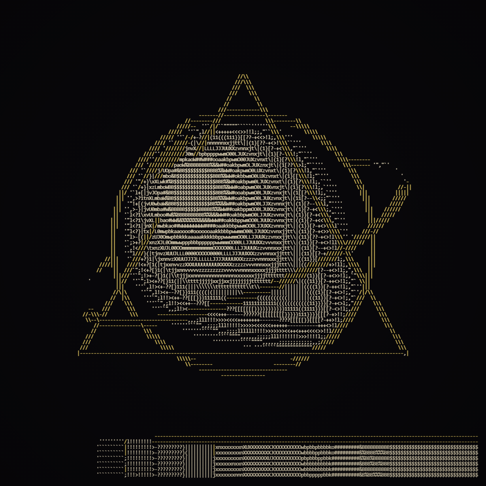
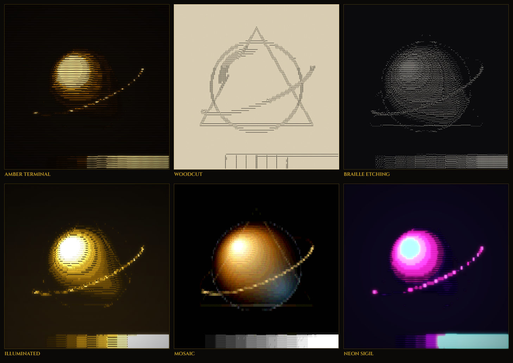
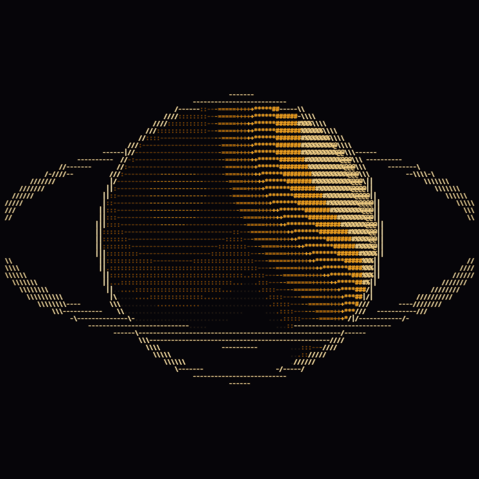

# ASCII_DOVE

A studio for turning images, video and live capture into glyph art.

### ▶ [Try it live](https://dozer3530.github.io/ASCII_DOVE/)

Everything runs in the browser, locally. No build step, no dependencies, no
uploads — your images never leave your machine.



*The built-in test chart at 170 columns: 70-level ASCII ramp for tone, with the
edge pass tracing contours in gold. Every character is real, selectable text if
you export it as `.txt`, `.svg` or `.html`.*

## Run it

The [hosted copy](https://dozer3530.github.io/ASCII_DOVE/) is the quickest way
in and has everything, camera included — it is served over HTTPS, which is all
the browser needs. To run it yourself:

**Windows** — double-click **`run.bat`**. It starts the local server and opens
your browser.

**Anything else:**

```bash
node serve.js
```

Then open **http://localhost:8777**.

Double-clicking `index.html` works too, but browsers only offer the camera,
screen capture and "copy image to clipboard" features over `http://localhost`,
so the server is the better way in.

---

## The same source, six treatments



Six of the 47 built-in presets. Each is one click from the preset menu, and
every parameter behind them stays editable.

---

## What's in it

**101 character sets across 12 categories** — classic ASCII ramps, numbers,
symbols, block and shading glyphs, all 256 Braille patterns sorted by dot
count, geometric shapes, twelve writing systems (including Elder Futhark and
Ogham), cards, chess, alchemical and zodiac marks, box drawing, and more.

**Live glyph previews.** Every set in the armoury renders its own tone strip,
so you see the actual ramp in the actual font before you pick it — including
whether your system has the glyphs at all.

**A real edge pass.** A Sobel filter runs on a supersampled, square-pixel copy
of the frame and replaces cells on strong contours with directional strokes
(`- / | \`). This is the thing that makes shapes read as shapes instead of
tonal mush. Eight stroke sets, and it can overlay tone or replace it entirely.

**Character depth and offset**, both animatable. Depth sets how many tone steps
the ramp is divided into; offset rotates the luminance-to-glyph mapping.

**Custom glyph injection** — paste up to 10 characters and blend them into the
ramp, append or prepend them, or replace the set outright.

**Measured density sorting.** ASCII_DOVE can render every glyph in your chosen
font, measure its actual ink coverage, and reorder the ramp accordingly. This
is what makes exotic scripts and hand-made sets behave like a real tone ramp.

**Colour** — single colour, sampled from the source, mapped to one of 27
palettes (Game Boy, C64, NES, PICO-8, CGA, EGA, phosphor terminals, studio
palettes), mapped through one of 14 gradients, or duotone. Transparent, solid,
gradient or source backgrounds.

**Dithering** — Floyd–Steinberg, Atkinson, Jarvis, Stucki, Burkes, Sierra,
ordered Bayer at 2/4/8/16, and white noise.

**Sources** — images, video, animated GIF/WebP/APNG, folders of frames, the
webcam, and screen capture.

**Animation** — bind an LFO to any of 31 parameters. Eleven waveforms, each
with rate, amount, phase and seed, riding on top of your slider value or
sweeping the full range.



*Nothing here is moving except the character offset, sweeping the katakana ramp
on a saw wave. The image is a still.*

**Export** — PNG, JPEG, plain text, ANSI (24-bit colour for terminals), SVG and
HTML (both stay live, selectable text), animated GIF, WebM video, and ZIP
archives of PNG or text frame sequences.

**Undo/redo** across every parameter and LFO binding, 80 steps deep. A slider
drag collapses into a single step, and a stray <kbd>R</kbd> (Roll) or Reset is
always recoverable.

**Presets** — 47 built in across seven groups (Terminal, Print, Line, Script,
Symbol, Colour & Texture, Motion), plus save/load/import/export as JSON. Your
working state is restored when you come back.

---

## Getting started

1. Drop an image anywhere on the window (or press <kbd>O</kbd>).
2. Pick a character set from the left rail.
3. Turn the **Characters → Character depth** and **Tone → Contrast** knobs
   until it reads well.
4. Turn on **Edges → Mode: Overlay** and raise **Strength**. This is usually
   the single biggest improvement.
5. <kbd>E</kbd> to export.

Press <kbd>R</kbd> to roll a random treatment — it changes the look but keeps
your framing, and <kbd>Ctrl</kbd>+<kbd>Z</kbd> puts it back if you liked what
you had.

### Shortcuts

| | |
|---|---|
| <kbd>Ctrl</kbd>+<kbd>Z</kbd> | undo |
| <kbd>Ctrl</kbd>+<kbd>Shift</kbd>+<kbd>Z</kbd> | redo |
| <kbd>O</kbd> | open a file |
| <kbd>Space</kbd> | play / pause |
| <kbd>F</kbd> / <kbd>1</kbd> | fit to view / actual pixels |
| <kbd>T</kbd> | plain-text view |
| <kbd>E</kbd> | export |
| <kbd>S</kbd> | save preset |
| <kbd>R</kbd> | roll a random look |
| <kbd>[</kbd> <kbd>]</kbd> | character offset −/+ |
| <kbd>,</kbd> <kbd>.</kbd> | depth −/+ |
| <kbd>&lt;</kbd> <kbd>&gt;</kbd> | columns −/+ |
| <kbd>I</kbd> / <kbd>X</kbd> | invert / reverse ramp |
| <kbd>↑</kbd> <kbd>↓</kbd> | previous / next character set |
| <kbd>?</kbd> | all shortcuts |

Hold <kbd>Shift</kbd> with the bracket and comma keys for bigger steps.
Double-click any slider to reset it to its default. Scroll to zoom the plate,
drag to pan, double-click the canvas to re-fit.

---

## Two things worth understanding

**Ramps run dark → light.** Index 0 of every set is the emptiest glyph and the
last is the densest, which suits light glyphs on a dark ground. For dark ink on
light paper, use **Reverse ramp** (<kbd>X</kbd>) — *not* Invert. Invert flips
the image; on a light ground that flips a second time and cancels out. The
`Ink on Vellum` and `Halftone Press` presets show the correct setup.

**Cell aspect is not decoration.** Monospace cells are about twice as tall as
they are wide, and `Grid → Cell aspect` tells the renderer that so your image
doesn't come out stretched. 2.0 suits most fonts; check it if a circle in your
source isn't a circle on the plate.

---

## Performance

Measured on a 3839×2400 photo:

| setup | per frame |
|---|---|
| 120 columns | ~29 ms |
| 200 columns | ~34 ms |
| 300 columns | ~39 ms |
| 200 columns + edges (2× supersample) | ~67 ms |
| 200 columns + edges (3×) | ~75 ms |
| 200 columns, everything on | ~113 ms |

The edge pass roughly doubles the cost, so turn it off while you set up tone
and back on when you're close. The grid is capped at 600,000 cells.

**Exports:** GIF and the ZIP sequences render frame by frame and are exact.
WebM goes through `MediaRecorder`, which captures in real time — if a frame
takes longer than its slot, that frame gets held. For anything slow, prefer GIF
or the PNG sequence.

---

## Layout

```
index.html          markup and script order
run.bat             Windows launcher: starts the server, opens the browser
serve.js            dependency-free static server
docs/               README images
css/app.css         all styling
tests/test.html     37 self-tests — open it in a browser
js/
  charsets.js       the 101 sets, injection, measured density sorting
  palettes.js       27 palettes, 14 gradients, colour maths
  imageproc.js      sampling, tone, blur/sharpen, dithering, the Sobel pass
  renderer.js       grid geometry, glyph selection, painting, post effects
  media.js          images, video, animated formats, sequences, camera, screen
  params.js         the parameter schema — one source of truth
  anim.js           LFO waveforms and the transport clock
  presets.js        47 factory presets, localStorage, JSON import/export
  exporters.js      PNG, JPEG, TXT, ANSI, SVG, HTML, GIF, WebM, ZIP
  ui.js             control panel, glyph armoury, modals, toasts
  main.js           application controller
  lib/zip.js        store-only ZIP writer
  lib/gifenc.js     GIF89a encoder (median-cut quantiser + LZW)
```

Plain `<script>` tags and a global `SS` namespace — no modules, no bundler, so
it runs from the filesystem as happily as from a server. The only network
request is the Google Fonts stylesheet, which degrades to system fonts offline.

### Adding a character set

Add an entry to the right category in `js/charsets.js`:

```js
{ id: 'myset', name: 'My Set', chars: ' ·:+*#@' }
```

Ordered dark → light. It appears in the armoury, the preset format and the
tests automatically. Add `mono: false` if the glyphs come from a proportional
symbol font.

### Adding a parameter

Add it to the right group in `js/params.js`. The control, the preset field and
the LFO binding are all generated from that one entry. Mark it `anim: true` to
make it animatable.

---

## Tests

Open `tests/test.html` from the same server. It exercises the render pipeline,
the Sobel orientation mapping, the quantisers, the LFO ranges, and the GIF and
ZIP encoders against known inputs — including decoding the GIF it just wrote
back through `ImageDecoder` to confirm the frames and timings are real.

---

## Browser support

Chrome, Edge and other Chromium browsers get everything. Firefox and Safari
render and export fine; animated GIF/WebP input needs `ImageDecoder`
(Chromium-only for now) and falls back to showing the first frame. Clipboard
image copy needs `ClipboardItem`.

---

## Licence

MIT — see [LICENSE](LICENSE).
